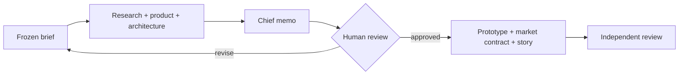

# PredictKit workshop agents

A small, open-source kit for teaching builders to turn one prediction-market idea into an honest prototype and demo plan with AI assistance. **It contains role prompts, project skills, and instructions only.** No PredictKit server, Python coordinator, Solana program, live trading, wallet integration, or deployment is included.

## Start in five minutes

1. Clone this repository and open the folder in Codex or Claude Code.
2. Stay in this repository. Copy `examples/brief.md` to an ignored `runs/<your-project>/brief.md`, then fill it with one real decision and a precise YES/NO/VOID question.
3. Ask your assistant: “Follow `WORKSHOP.md` using my brief. Run discovery first, produce the chief memo, and stop for my review before building.”
4. Review and approve or revise the memo. Then ask for the prototype, domain contract, draft story, and final review.

Codex discovers project skills from `.agents/skills/`; Claude Code discovers them from `.claude/skills/`. Claude Code can also load the eight `pk-*` custom subagents from `.claude/agents/`; each has its matching skill preloaded. Skills are instructions, not a guaranteed multi-agent runtime. If your assistant cannot delegate, run the roles sequentially using `agents/<role>.md`. The two skill trees intentionally contain identical files; edit both if contributing a change. [Codex skill paths](https://developers.openai.com/codex/skills) · [Claude Code skills](https://code.claude.com/docs/en/skills) · [Claude Code subagents](https://code.claude.com/docs/en/sub-agents).

## One-page map

| Phase | Role | Skill | Deliverable |
|---|---|---|---|
| Discover | Evidence lead | `collect-evidence` | `research/market.md` |
| Discover | Product lead | `specify-market` | `product/spec.md` |
| Discover | Solana architect | `select-solana-adapter` | `architecture/plan.md` |
| Decide | Chief of staff | `frame-opportunity` | `decisions/build-memo.md` |
| Build | Prototype builder | `build-prediction-ui` | `app/index.html` |
| Build | Market designer | `specify-market` | `app/market.json`, `domain/resolution.md` |
| Build | Story and demo lead | `prepare-submission` | `submission/` drafts |
| Review | Review lead | `verify-outcome` | `qa/review.md` |

The workshop can produce an **off-chain simulation**. Live AI generation, connected Solana execution, deployed behavior, and participant success each need separate evidence. See `WORKSHOP.md` for the 90-minute activity and checks.

MIT licensed. The full PredictKit application is a [separate repository](https://github.com/megandmartin/predictkit). This kit works without it.
