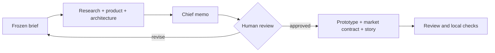

# PredictKit workshop agents

A small, open-source kit for teaching builders to turn one prediction-market idea into an honest prototype and demo plan with AI assistance. **It contains the eight detailed role prompts and all ten skills adapted from the original PredictKit source, plus setup and workshop guides.** No PredictKit server, Python coordinator, Solana program, live trading, wallet integration, or deployment is included.

**[Open the visual workshop guide](docs/index.html)** · [Browse all agents and skills](CATALOG.md) · [Copy-ready Codex and Claude Code prompts](PROMPTS.md) · [90-minute facilitator plan](WORKSHOP.md)

## Start in five minutes

1. Clone this repository and open the folder in Codex or Claude Code.
2. Stay in this repository. Copy `examples/brief.md` to an ignored `runs/<your-project>/brief.md`, then fill it with one real decision and a precise YES/NO/VOID question.
3. Use the setup and discovery prompts in [PROMPTS.md](PROMPTS.md), or copy them from the visual guide. They name the exact files and stop at the human review gate.
4. Review and approve or revise the memo. Then ask for the prototype, domain contract, draft story, and final review.

Codex discovers project skills from `.agents/skills/`; Claude Code discovers them from `.claude/skills/`. Claude Code can also load the eight `pk-*` custom subagents from `.claude/agents/`; each preloads all skills mapped to its role. Skills are instructions, not a guaranteed multi-agent runtime. If your assistant cannot delegate, run the roles sequentially using `agents/<role>.md`. The two skill trees intentionally contain identical files; edit both if contributing a change. [Codex skill paths](https://developers.openai.com/codex/skills) · [Claude Code skills](https://code.claude.com/docs/en/skills) · [Claude Code subagents](https://code.claude.com/docs/en/sub-agents).

## One-page map

| Phase | Role instruction | Skills loaded for that role | Deliverable |
|---|---|---|---|
| Discover | [Evidence lead](agents/research.md) | `frame-opportunity`, `collect-evidence` | `research/market.md` |
| Discover | [Product lead](agents/product.md) | `frame-opportunity`, `specify-market` | `product/spec.md` |
| Discover | [Solana architect](agents/architect.md) | `select-solana-adapter`, `specify-market` | `architecture/plan.md` |
| Decide | [Chief of staff](agents/chief.md) | `parallel-build` | `decisions/build-memo.md` |
| Build | [App engineer](agents/frontend.md) | `build-prediction-ui`, `parallel-build` | `app/index.html` |
| Build | [Market designer](agents/domain.md) | `specify-market`, `verify-outcome` | `app/market.json`, `domain/resolution.md` |
| Build | [Submission lead](agents/submission.md) | `prepare-submission`, `collect-evidence` | `submission/` drafts |
| Review | [Reviewer](agents/reviewer.md) | `verify-outcome`, `collect-evidence` | `qa/review.md` |

The other two packaged skills, `run-workshop` and `continue-sprint`, guide the facilitator and later continuation. Every skill is available in both project skill trees. The original role files' detailed edge cases, handoffs, and limits are retained here; references to the old Python output wrapper and unavailable tools have been adapted to this standalone workflow.

The workshop can produce an **off-chain simulation**. Live AI generation, connected Solana execution, deployed behavior, and participant success each need separate evidence. See `WORKSHOP.md` for the 90-minute activity and checks.

To check a fresh clone's role/skill wiring and guide links without calling an AI provider, run `python3 scripts/check_kit.py`. This validates the kit structure; it does not test a generated prototype. The [visual guide](docs/index.html) can be opened in a browser from the cloned folder.

MIT licensed. The full PredictKit application is a [separate repository](https://github.com/megandmartin/predictkit). This kit works without it.
